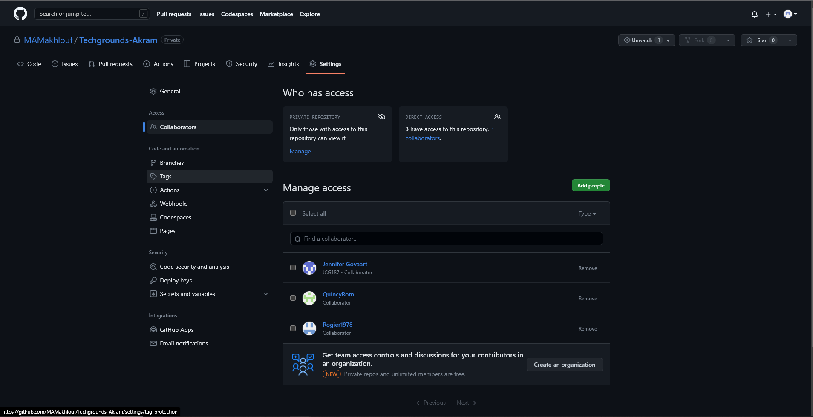

# [Git & Github]

[Algemene kennismaking met Git & Github]

## Key-terms

○ Repository  
Opslagplaats in Github   
○ Main / Master   
-Elke repository kan een of meer branches hebben. De "hoofdtak", waar alle wijzigingen uiteindelijk weer in worden samengevoegd, wordt master genoemd.  
○ Branch  
-Een ingesloten gebied van de repository. Je maakt altijd een branch van een bestaande branch.  
○ Commit  
-Een commit registreert wijzigingen in een of meer bestanden in uw branch.  
○ Push / Pull  
-Pushen stuurt de recente commit geschiedenis van je lokale repository naar GitHub.  
-Een pull haalt alle wijzigingen uit de GitHub-repository en voegt ze samen in uw lokale repository.  
○ Merge  
-Een merge request is een verzoek van iemand om code van de ene branch naar de andere te mergen  
○ Fork  
Een fork is een nieuwe repository die code en zichtbaarheidsinstellingen deelt met de originele repository.  

## Opdracht

### Gebruikte bronnen

[https://docs.github.com/en]

### Ervaren problemen.

[Geen problemen gehad. Ik heb gelukkig eerder een beetje gewerkt met Github]

### Resultaat

[De opdrachten zijn gelukt omdat alle vereisten zijn voldaan.]

